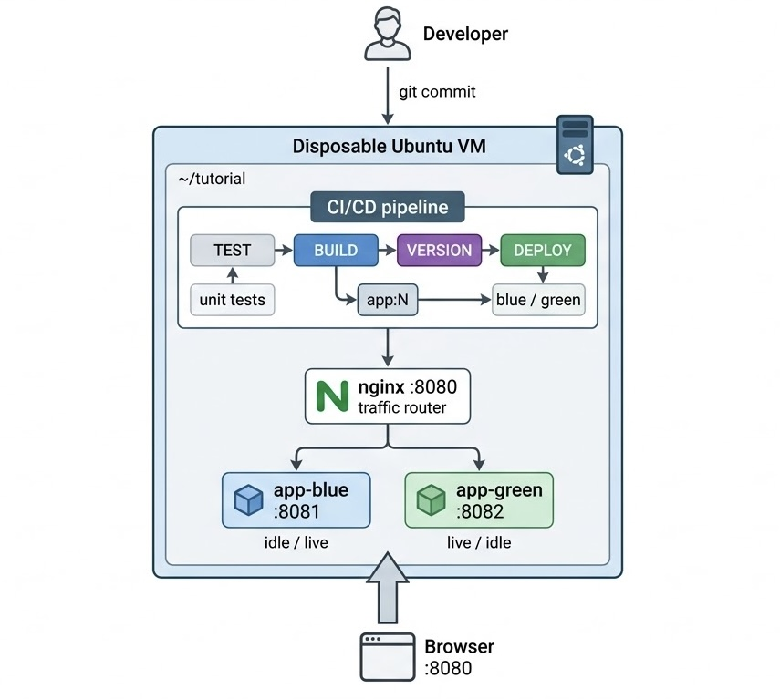

# Ship It: Continuous Delivery vs. Continuous Deployment

## The problem

It's 17:00 on a Friday. Your team releases once a month, by hand: someone SSHes to a server, stops the app, copies files, edits configuration, restarts, and prays. Every release is a small lottery.

Boehm's classic software-engineering economics argues that defects generally become more expensive to fix when they are discovered later in the development lifecycle. One response has historically been to release less often, which can make each release larger and riskier.

Continuous delivery and continuous deployment flip this logic: when changes can move through a highly automated pipeline, each release can be smaller and easier to verify. A fast feedback loop also makes failures easier to isolate and recover from.

> **Adage 2 — The Cost of Change Is Dead.** The _Top 10 Adages in Continuous Deployment_ argues that when development and production feedback loops become much shorter, the traditional cost-of-change curve becomes less relevant to modern deployment practices.

**"Ready or not, here it comes" (Adage 10):** the DevOps research cited in the course material found that high-performing organizations deployed much more frequently and experienced substantially lower change-failure rates than lower-performing organizations.

The goal of this tutorial is to understand **why** that can work — and what has to be true before it is safe.

## What you will build

A complete, automated delivery system for a small web service called **Demo Shop**.

**Figure 1.** The tutorial's CI/CD architecture. A commit triggers testing, building, versioning, and deployment inside a disposable Ubuntu VM. nginx acts as the only user-facing entry point and switches traffic between the blue and green application slots.

How the components interact: Git provides the source change to the pipeline. The pipeline runs tests and builds a versioned artifact. During deployment, the artifact is started in whichever application slot is currently idle. The smoke test communicates directly with that slot to verify it. Only after verification succeeds does flip.sh update nginx's upstream configuration. nginx then reloads its configuration and begins sending user requests to the new slot. Because the previous slot remains available, rollback can restore the previous upstream configuration.

The important idea is that **only nginx receives user traffic**. The pipeline deploys the new version to the idle environment, verifies it, and then changes the proxy configuration to switch traffic.

This gives us two distinct decisions:

**Deployment:** put the new version into an environment and verify that it works.

**Release:** decide whether users should receive traffic from that version.

Continuous Delivery keeps the release decision available to a human. Continuous Deployment automates that final decision.

## Intended Learning Outcomes (ILOs)

After completing this tutorial, you will be able to:

- Distinguish **Continuous Integration, Continuous Delivery, and Continuous Deployment**, and identify the step where delivery ends and deployment begins.
- Implement an automated pipeline that performs **test → build → version → deploy**.
- Perform a **blue-green release** with automated verification and no planned downtime.
- Explain why a broken release can be aborted before users see it, and how **instant rollback** works.
- Explain **"fast to deploy, slow to release"** using dark launches and feature flags.
- Evaluate when **Continuous Deployment** is appropriate — and when a manual release gate is more appropriate.

## Grounding material

This tutorial builds on the following material:

- [An Introduction to Continuous Integration, Delivery and Deployment](https://www.digitalocean.com/community/tutorials/an-introduction-to-continuous-integration-delivery-and-deployment)
- _The Top 10 Adages in Continuous Deployment_ — Parnin et al.
- [Continuous delivery](https://en.wikipedia.org/wiki/Continuous_delivery)
- [Continuous deployment](https://en.wikipedia.org/wiki/Continuous_deployment)
- [Blue-green deployment](https://en.wikipedia.org/wiki/Blue%E2%80%93green_deployment)
- [Deployment environment](https://en.wikipedia.org/wiki/Deployment_environment)

## Before you start

No accounts or cloud credentials are required. Everything runs inside this disposable VM.

Click **START** and wait until the setup message says that the environment is ready. Then begin with **Step 1**.
